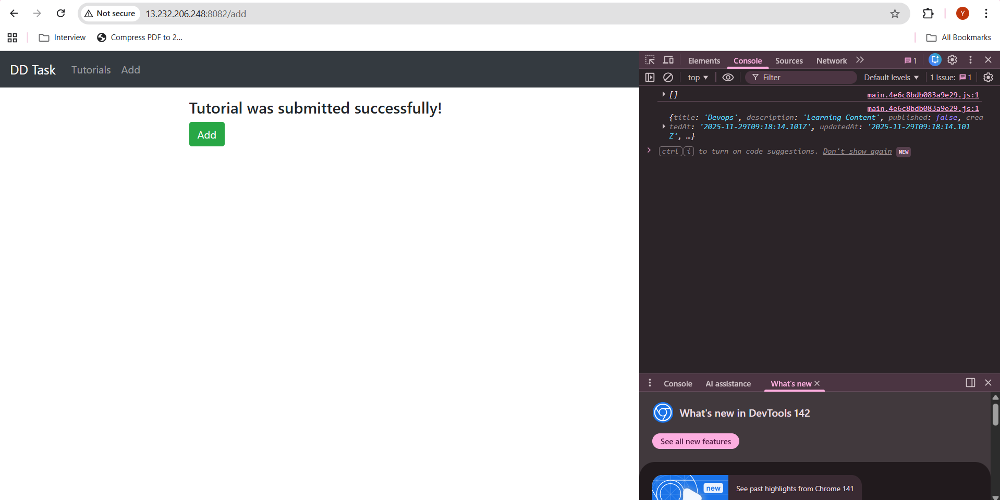
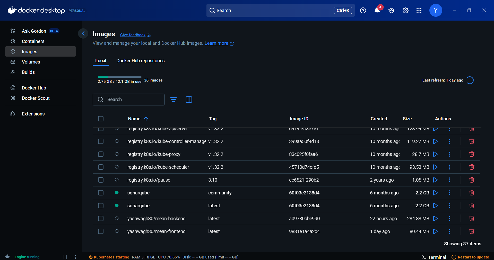

# 🚀 Discover Dollar – Full Stack MEAN Application

MongoDB | Express | Angular | Node.js | Docker | GitHub Actions | AWS EC2

<p align="center">
  
  
  
  
</p>

## 📌 Project Overview

This project is a CRUD application built using the MEAN stack:

- **MongoDB** – Database  
- **Express.js** – Backend REST API
- **Angular 15** – Frontend UI
- **Node.js** – Server
- **Docker** – Containerization
- **GitHub Actions** – CI/CD Pipeline
- **AWS EC2** – Hosting

### Users can:
- ➕ Add a tutorial
- 📄 View tutorials
- ✏️ Update a tutorial
- ❌ Delete a tutorial
- 🔍 Search tutorials by title




---

## 🏗️ Architecture Diagram
```
                 ┌───────────────────────────────┐
                 │         GitHub Repo            │
                 └──────────────┬────────────────┘
                                │ Push
                                ▼
                     ┌──────────────────────┐
                     │ GitHub Actions CI/CD │
                     └──────────────┬────────┘
                                    │ Builds Images
                                    ▼
                     ┌───────────────────────────────┐
                     │  Docker Hub (Backend/Frontend) │
                     └──────────────┬────────────────┘
                                    │ Pull
                                    ▼
           ┌──────────────────────────────────────────────────┐
           │                    AWS EC2                       │
           │  ┌─────────────┐  ┌───────────────┐  ┌────────┐ │
           │  │  Frontend   │  │   Backend     │  │ MongoDB│ │
           │  │ (Angular+N) │  │ (Node+Exp.)   │  │        │ │
           │  └─────────────┘  └───────────────┘  └────────┘ │
           └──────────────────────────────────────────────────┘


```
<p align="center">
  
  
  
</p>
---

## 📁 Project Structure

```
Discover_Dollar/
│
├── backend/               # Express.js + Node.js API
│   ├── app/
│   ├── server.js
│   ├── Dockerfile
│
├── frontend/              # Angular 15 frontend
│   ├── src/
│   ├── Dockerfile
│
├── docker-compose.yml     # For EC2 deployment
├── README.md
```


---

## 🐳 Docker Setup

**Build & Run Locally**

```bash
docker-compose up --build
```



### Containers:
| Service   | Port   | Description                |
|-----------|--------|---------------------------|
| Frontend  | 8082   | Angular App (Nginx)       |
| Backend   | 8080   | Node.js API               |
| MongoDB   | 27017  | Database                  |

---

## ⚙️ GitHub Actions – CI/CD

The pipeline automatically:
- ✅ Builds Docker images for frontend & backend
- ✅ Pushes them to Docker Hub
- ✅ SSH into EC2
- ✅ Pulls new images
- ✅ Restarts application

**Workflow file**: `.github/workflows/deploy.yml`


```yaml
name: CI/CD MEAN Application Deploy

on:
  push:
    branches: ["main"]

jobs:
  deploy:
    runs-on: ubuntu-latest

    steps:
    - name: Checkout
      uses: actions/checkout@v3

    - name: Docker Login
      uses: docker/login-action@v2
      with:
        username: ${{ secrets.DOCKERHUB_USERNAME }}
        password: ${{ secrets.DOCKERHUB_PASSWORD }}

    - name: Build & Push Backend
      run: |
        docker build -t ${{ secrets.DOCKERHUB_USERNAME }}/mean-backend:latest ./backend
        docker push ${{ secrets.DOCKERHUB_USERNAME }}/mean-backend:latest

    - name: Build & Push Frontend
      run: |
        docker build -t ${{ secrets.DOCKERHUB_USERNAME }}/mean-frontend:latest ./frontend
        docker push ${{ secrets.DOCKERHUB_USERNAME }}/mean-frontend:latest

    - name: Deploy to EC2
      uses: appleboy/ssh-action@v0.1.8
      with:
        host: ${{ secrets.EC2_HOST }}
        username: ${{ secrets.EC2_USER }}
        key: ${{ secrets.EC2_KEY }}
        script: |
          cd ~/Discover_Dollar
          sudo docker pull ${{ secrets.DOCKERHUB_USERNAME }}/mean-backend:latest
          sudo docker pull ${{ secrets.DOCKERHUB_USERNAME }}/mean-frontend:latest
          sudo docker-compose down
          sudo docker-compose up -d
```

---

## 🔐 Required GitHub Secrets

| Secret Name         | Description                  |
|---------------------|-----------------------------|
| DOCKERHUB_USERNAME  | Docker Hub username         |
| DOCKERHUB_PASSWORD  | Docker Hub access token     |
| EC2_HOST            | EC2 public IP               |
| EC2_USER            | usually ubuntu              |
| EC2_KEY             | Private SSH key (.pem)      |

---

## 🌐 Environment Config

### Backend (`server.js`)
```js
const corsOptions = {
  origin: ["http://13.232.206.248:8082"],
  methods: ["GET", "POST", "PUT", "DELETE", "OPTIONS"],
  allowedHeaders: ["Content-Type", "Authorization"],
  credentials: true
};
```

### Frontend (`tutorial.service.ts`)
```ts
const baseUrl = "http://13.232.206.248:8080/api/tutorials";
```

---

## 🧪 Testing API

```bash
curl http://13.232.206.248:8080/api/tutorials
```

---

## 🚀 Deployment Commands (Manual on EC2)

```bash
docker-compose pull
docker-compose up -d
```

---


## 🙌 Author

**Yash Wagh**    
GitHub: [https://github.com/yashwagh30](https://github.com/yashwagh30)
